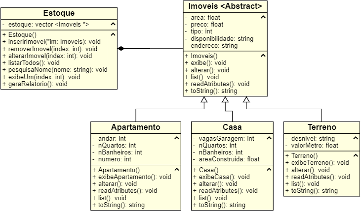

# Projeto CRUD - Tema: Imobiliaria

Sistema de controle de estoque de uma imobiliária feito para avaliar conhecimentos de Programação Orientada a Objetos em C++ na disciplina de Linguagem de Programação I.

Professores: Derzu Omaia e Marcelo Iury

## Especificações gerais:
1. Inserir, remover e alterar imóveis.
2. Pesquisar por nome.
3. Exibir um e listar todos.
4. Gerar relatório com as informações do estoque.
5. O programa deve rodar indefinidamente, até que o usuário decida sair.
6. Todos os dados do programa devem ser salvos em arquivo, para que ao sair os dados não se percam.
7. Ao abrir o programa novamente, os dados salvos devem ser carregados.

## Diagrama de Classes
 
